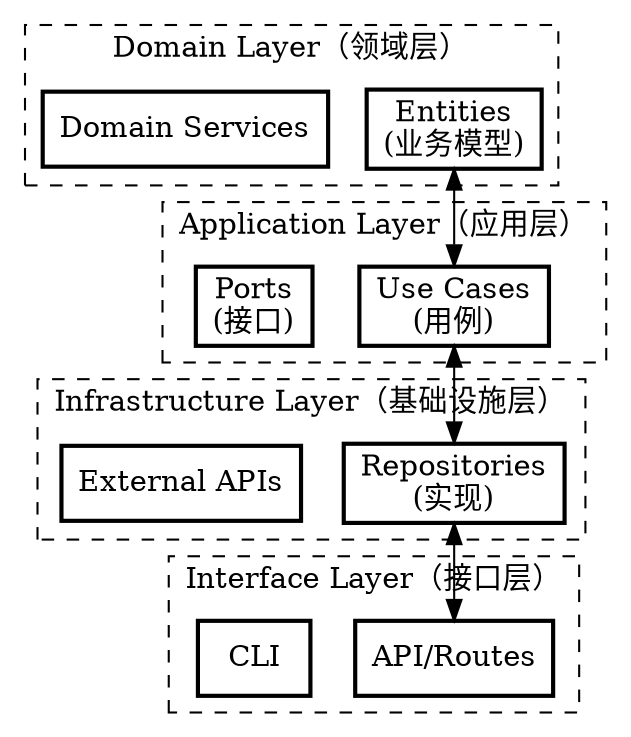

# 整洁架构

## 概述

**分层架构 + 依赖倒置：Domain（业务规则）、Application（用例）、Infrastructure（框架）、Interface（适配器）。**

## 适用场景

- 设计新项目架构
- 组织新模块结构
- 让代码可测试
- 分离业务逻辑与框架

## 四层架构



## 各层职责

| 层级 | 职责 | 示例 |
|------|------|------|
| **Domain** | 业务规则、实体 | `User`、`Order` 实体 |
| **Application** | 用例、工作流 | `CreateUser`、`ProcessOrder` |
| **Infrastructure** | 数据库、外部服务 | `UserRepository`、`PaymentGateway` |
| **Interface** | HTTP、CLI、WebSocket | `FastAPI routes`、`WebSocket` |

## 依赖规则

**内层不依赖外层。**

```python
# 错误：内层依赖外层
# app/services/user.py
from app.infrastructure.database import Session  # 违规！

# 正确：外层依赖内层（依赖倒置）
# app/core/ports.py
class DatabasePort(ABC):
    @abstractmethod
    def session(self): ...

# app/infrastructure/database.py
from app.core.ports import DatabasePort

class PostgresDatabase(DatabasePort):
    def session(self):
        return Session()

# app/services/user.py
from app.core.ports import DatabasePort

class UserService:
    def __init__(self, db: DatabasePort):  # 依赖抽象
        self.db = db
```

## 目录结构

```
src/
├── domain/              # 纯业务逻辑
│   ├── entities/        # 业务模型
│   ├── value_objects/   # 值对象
│   └── services/        # 领域服务
├── application/         # 用例
│   ├── use_cases/       # 业务流程
│   └── ports/           # 接口定义
├── infrastructure/      # 外部实现
│   ├── database/        # 数据库实现
│   ├── external/        # API、SDK
│   └── repositories/    # 仓储实现
├── interface/           # 入口
│   ├── api/             # HTTP 路由
│   ├── cli/             # 命令行
│   └── ws/              # WebSocket
└── core/                # 共享（配置、异常）
```

## 依赖关系图

```
Interface -> Application -> Domain
   |           |            |
   v           v            v
Infrastructure <- (依赖倒置)
```

## 各层测试策略

| 层级 | 测试类型 | Mock |
|------|----------|------|
| Domain | 单元测试 | 无需 mock |
| Application | 单元测试 | Mock 基础设施层 |
| Infrastructure | 集成测试 | 真实数据库/服务 |
| Interface | 集成测试 | 测试客户端 |

## 核心要点

**整洁架构 = 分层独立 + 依赖倒置 + 可测试的业务逻辑。**

---

## 相关文件

- [fastapi-project/architecture.md](../fastapi-project/architecture.md) - FastAPI 实战分层架构
