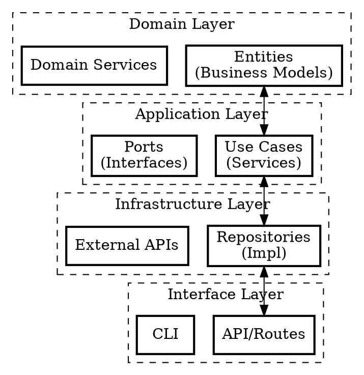

# Clean Architecture

## Overview
**Layered architecture with dependency inversion: Domain (business rules), Application (use cases), Infrastructure (frameworks), and Interface (adapters).**

## When to Use
- Designing new project architecture
- Structuring a new module
- Making code testable
- Separating business logic from frameworks

## The Four Layers



## Layer Responsibilities

| Layer | Responsibility | Example |
|-------|---------------|---------|
| **Domain** | Business rules, entities | `User`, `Order` entities |
| **Application** | Use cases, workflows | `CreateUser`, `ProcessOrder` |
| **Infrastructure** | DB, external services | `UserRepository`, `PaymentGateway` |
| **Interface** | HTTP, CLI, WebSocket | `FastAPI routes`, `WebSocket` |

## Dependency Rule

**Inner layers never depend on outer layers.**

```python
# Bad: Inner depends on outer
# app/services/user.py
from app.infrastructure.database import Session  # Violation!

# Good: Outer depends on inner (Dependency Inversion)
# app/core/ports.py
class DatabasePort(ABC):
    @abstractmethod
    def session(self): ...

# app/infrastructure/database.py
from app.core.ports import DatabasePort

class PostgresDatabase(DatabasePort):
    def session(self):
        return Session()

# app/services/user.py
from app.core.ports import DatabasePort

class UserService:
    def __init__(self, db: DatabasePort):  # Depends on abstraction
        self.db = db
```

## Directory Structure

```
src/
├── domain/              # Pure business logic
│   ├── entities/        # Business models
│   ├── value_objects/   # Immutable values
│   └── services/        # Domain services
├── application/         # Use cases
│   ├── use_cases/       # Business workflows
│   └── ports/           # Interface definitions
├── infrastructure/      # External concerns
│   ├── database/        # DB implementation
│   ├── external/        # APIs, SDKs
│   └── repositories/    # Port implementations
├── interface/           # Entry points
│   ├── api/             # HTTP routes
│   ├── cli/             # Command line
│   └── ws/              # WebSocket handlers
└── core/                # Shared (config, exceptions)
```

## The Dependency Graph

```
Interface -> Application -> Domain
   |           |            |
   v           v            v
Infrastructure <- (Dependency Inversion)
```

## Testing Across Layers

| Layer | Test Type | Mock |
|-------|-----------|------|
| Domain | Unit | No mocks needed |
| Application | Unit | Mock infrastructure |
| Infrastructure | Integration | Real DB/services |
| Interface | Integration | Test client |

## The Bottom Line

**Clean Architecture = Independent layers, dependency inversion, testable business logic.**
