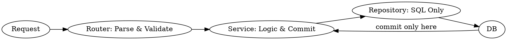

# FastAPI Layered Architecture

## Overview
**Strict separation: Router parses requests, Service handles business logic, Repository builds SQL, commit happens only in Service layer.**

## The Iron Law of Layers



## When to Use
- Starting a new production FastAPI project
- Refactoring endpoints with mixed concerns
- Onboarding new team members
- Any endpoint contains `select()` or `commit()` outside its layer

## Directory Structure

```
app/
├── api/endpoints/    # Routers - HTTP layer
├── services/         # Business logic
├── repositories/     # SQL building
├── models/           # DB models
└── schemas/          # Pydantic models
```

## Layer Responsibilities

| Layer | MUST Do | MUST NOT Do |
|-------|---------|------------|
| **Router** | Parse request, validate with Pydantic, call service | SQL, commit, business logic |
| **Service** | Business logic, call repo, `await db.commit()` | Request parsing, SQL construction |
| **Repository** | Build SQL queries, return model instances | Commit, business logic |

## Code Example

```python
# app/api/endpoints/users.py - Router
from fastapi import APIRouter, Depends
from app.schemas.user import UserCreate, UserResponse
from app.services.user import create_user

router = APIRouter()

@router.post("/users", response_model=UserResponse)
async def create_user_endpoint(data: UserCreate) -> UserResponse:
    return await create_user(data)  # Parse & call only

# app/services/user.py - Service
from app.repositories.user import UserRepository
from app.models.user import User
from app.schemas.user import UserCreate

async def create_user(data: UserCreate) -> User:
    repo = UserRepository(User)
    user = repo.create(data)
    await repo.db.commit()  # Service handles commit
    return user

# app/repositories/user.py - Repository
from app.models.base import BaseRepository

class UserRepository(BaseRepository[User]):
    async def find_by_email(self, email: str) -> User | None:
        return await self.db.execute(
            select(User).where(User.email == email)
        ).scalar_one_or_none()
```

## Common Violations

| Violation | Symptom | Fix |
|-----------|---------|-----|
| SQL in router | `select()` in endpoint | Move to repository |
| Commit in repo | `await db.commit()` in repo | Move to service |
| Data parsing in service | `User.model_validate()` in service | Parse in router |
| Circular imports | Import errors between layers | Follow Router -> Service -> Repo -> Model |

## Async Best Practices

```python
# ❌ Wrong - Sync in async
async def fetch_data():
    time.sleep(1)  # Blocks event loop!

# ✅ Correct - Async sleep
async def fetch_data():
    await asyncio.sleep(1)

# ❌ Wrong - Missing type hint
async def get_user(id): ...

# ✅ Correct - Full typing
async def get_user(id: int) -> User: ...
```

## The Bottom Line

**Where you put code matters more than what the code does.**

- Router = HTTP interface
- Service = Business decisions
- Repository = Data access
- Database = Storage only

Violate this = technical debt that compounds forever.
